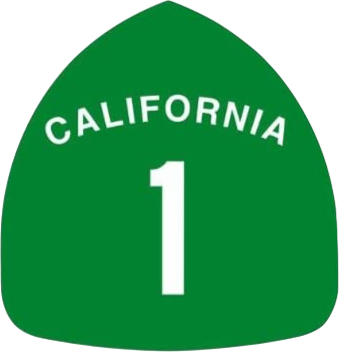
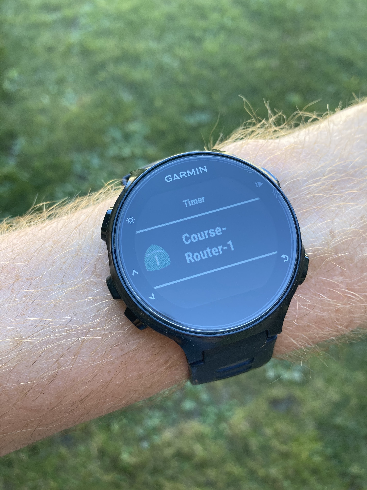
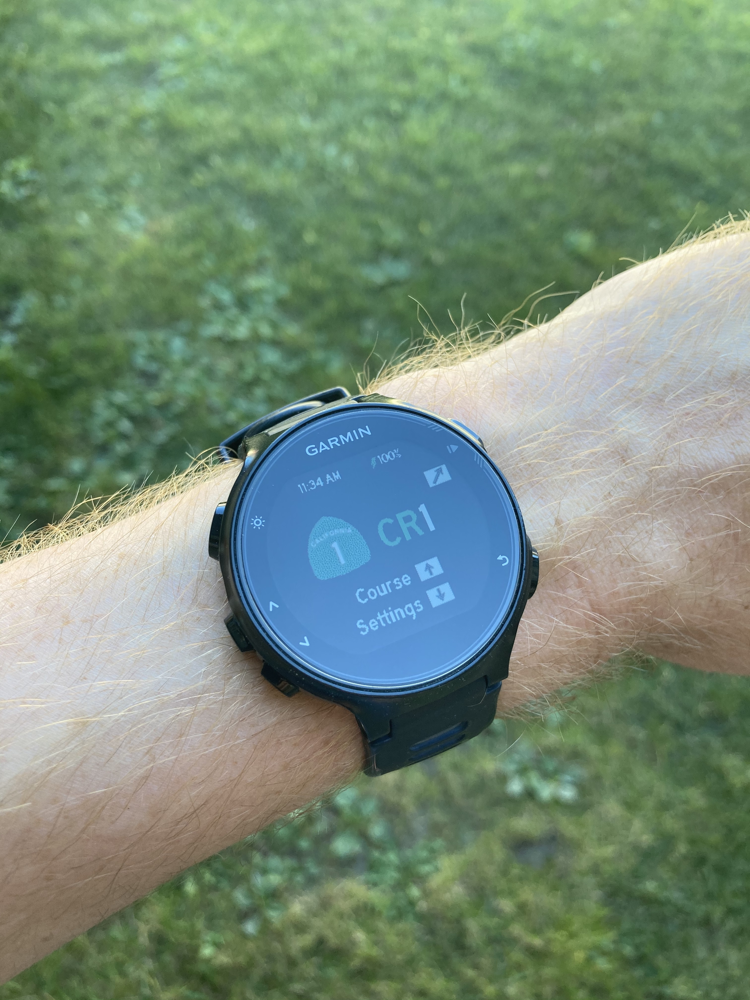
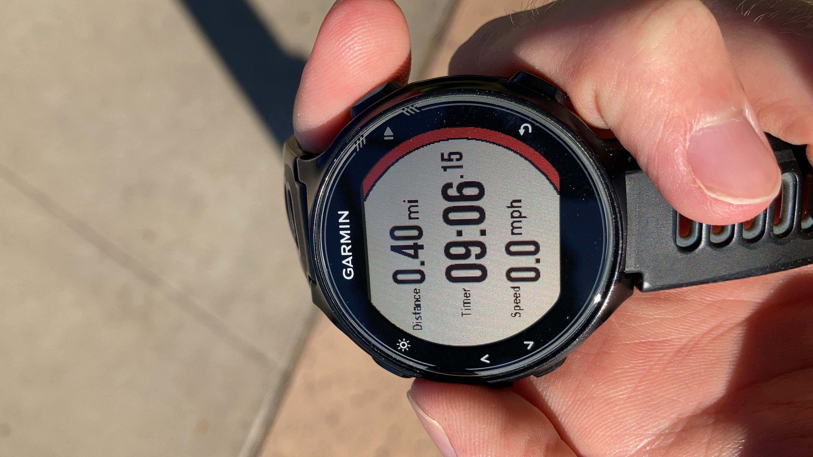
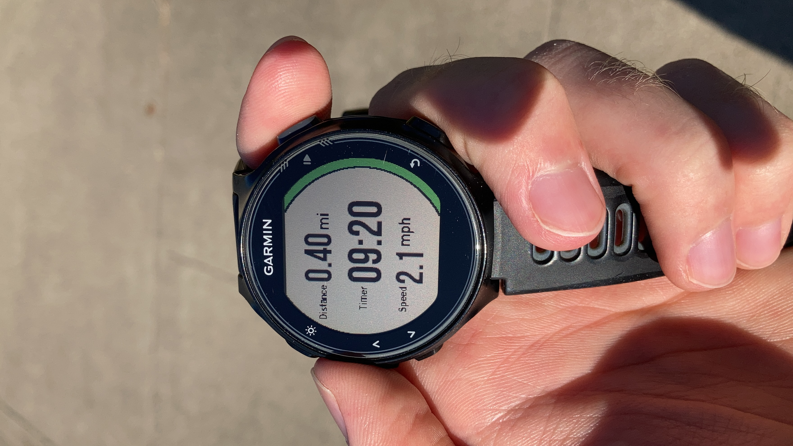
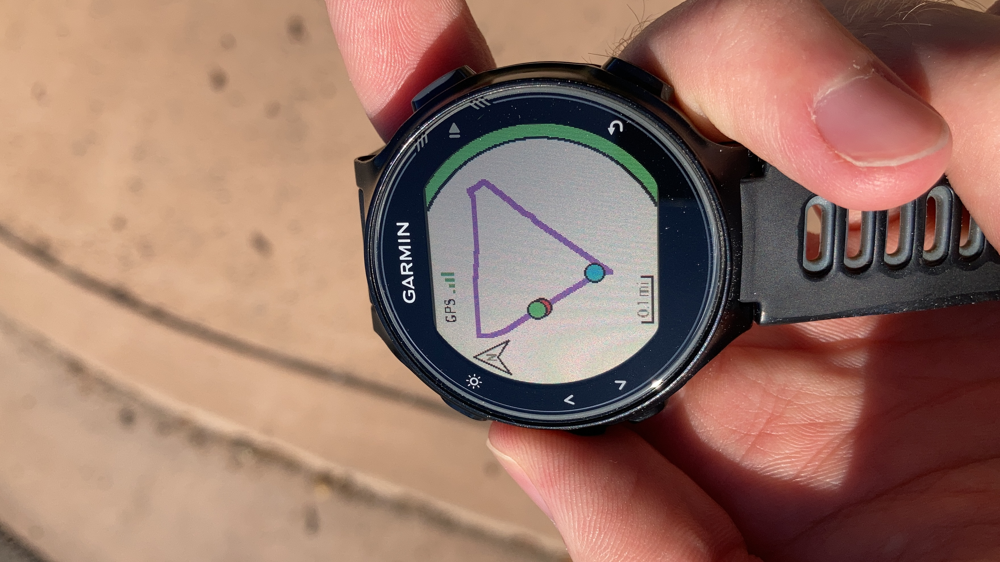
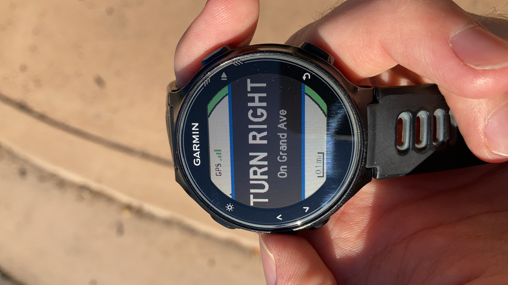
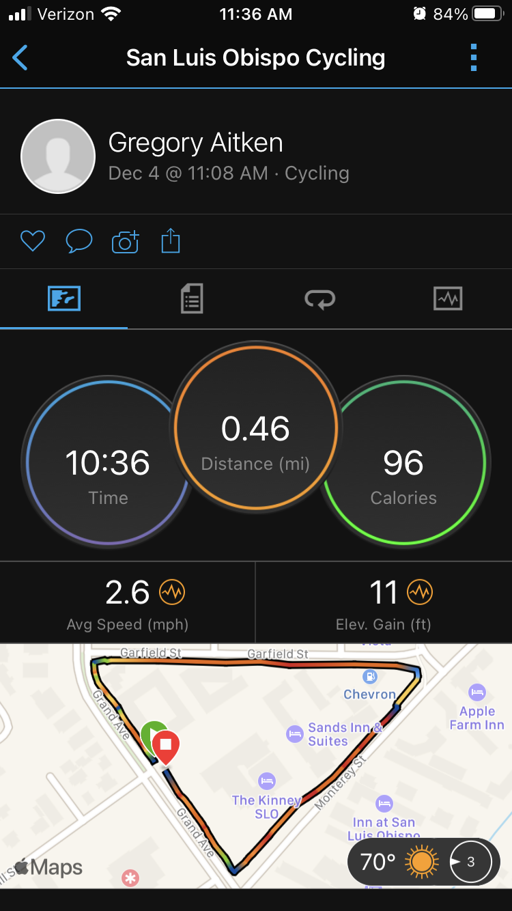

## Overview

CourseRouter1 is a Garmin watch app that provides activity tracking and turn-by-turn navigation for preplanned cycling routes. It has been specifically developed for and tested on the Garmin Forerunner 735XT multisport watch. The app is currently in Alpha (pre-release) stage. I hope to continue improving CourseRouter1 over the next several months and eventually publish it to the [Garmin Connnect IQ Store](https://apps.garmin.com/en-US/) for free download and use.

## Current Features

- Activity Tracking:
  - Tracks time, distance, and speed during your activity with a simple data screen
  - Saves activities natively to your Garmin upon completion for upload to your phone
- Turn-by-Turn Navigation:
  - Displays your route and current location on a user-friendly map screen
  - Presents clear navigation alerts as you approach turns on your route

## In Action

### Launching the App

This is CourseRouter1 downloaded onto my watch.

### App Start Page

This is the start page which includes time of day, battery status, and options to select your course or change settings.

### Data Screen

This is the screen that first appears when starting an activity. It displays time, distance, and speed and allows you to start and stop recording (with the colored right border indicating the state).

### Map Screen

This is the other screen available while doing an activity and can be reached by pressing the up or down buttons. It shows the route in purple (with green start and red end points) and your current location as a blue dot. The GPS icon indicates the current signal strength and your position dot will change to yellow if this drops below two bars. The map is oriented with North at the top. The scale is actually just a placeholder for now but will be functional with a future update.

### Navigation Alert

This is an example of a nagivation alert that appears while following your route. It shows the direction in large letters with the street name below. This navigation information is contained in the course file. Each cue is tied to a specific geographic position and will be triggered when you are within a certain range. The default route is this small loop near my apartment in San Luis Obispo, CA.

### Activity Upload

This is the comlpeted activity synced to my Garmin Connect Mobile account. Activities tracked with CourseRouter1 are natively saved to your Garmin and can be uploaded to all your favorite services.

## Coming Soon

- Download and save cycling routes directly to CourseRouter1 from the most popular route planning services:
  - [Garmin](https://connect.garmin.com)
  - [Strava](https://www.strava.com)
  - [RWGPS](https://ridewithgps.com)
- Automatic generation of turn-by-turn navigation cues performed by proxy web server running on AWS.
- On-/off-course indication plus tones and vibration for alerts.
- Detailed route view with ability to zoom and move around the map.
- Additional data fields:
  - Elevation
  - Heart rate
  - Lap-based statistics
- Free for all to download from the Garmin Connect IQ Store!
